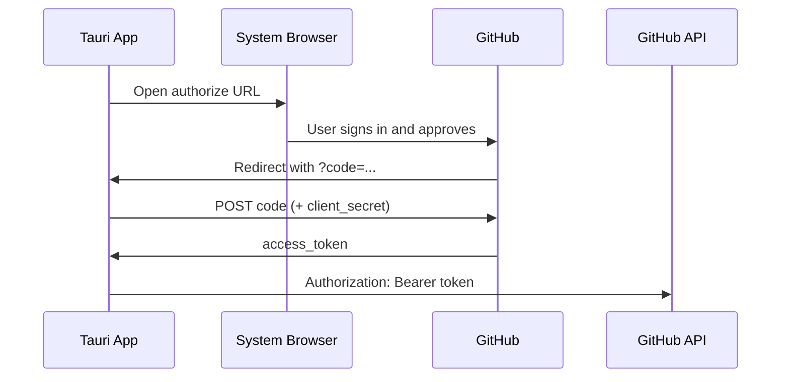

# GitHub OAuth for request-viewer

This app uses **direct GitHub OAuth** for authentication and GitHub API access. Clerk is not used.

## Why direct GitHub OAuth

- GitHub returns an API access token with scopes we control.
- No extra identity provider between the app and GitHub.
- Straightforward fit for a PR review tool that only talks to the GitHub API.

## OAuth App vs GitHub App

| | OAuth App | GitHub App |
|--|-----------|------------|
| Setup | Simpler | More setup, finer permissions |
| Token | Long-lived user access token | Short-lived user-to-server tokens |
| Scopes | Broad (`repo`, `read:org`, …) | Granular (`pull_requests: read`, `contents: read`, …) |
| Rate limits | Standard (5,000 req/hr authenticated) | Higher for installed apps |
| Best for | MVP, personal/small team tools | Production apps, org-wide installs |

**Recommendation:** Start with an **OAuth App** for MVP. Consider a **GitHub App** later if you need tighter permissions, higher rate limits, or org-level installation.

References:

- [Authorizing OAuth apps](https://docs.github.com/en/apps/oauth-apps/building-oauth-apps/authorizing-oauth-apps)
- [About creating GitHub Apps](https://docs.github.com/en/apps/creating-github-apps/about-creating-github-apps)

## Required scopes (OAuth App)

| Scope | Purpose |
|-------|---------|
| `repo` | Private repos, PRs, diffs, reviews, comments |
| `read:org` | List org repos (if users review org PRs) |
| `read:user` | Basic profile (avatar, login) |

Public-only MVP can use `public_repo` instead of `repo`.

## OAuth flow



### Endpoints

1. **Authorize** (open in browser):

   ```
   GET https://github.com/login/oauth/authorize
     ?client_id={CLIENT_ID}
     &redirect_uri={REDIRECT_URI}
     &scope=repo,read:org,read:user
     &state={RANDOM_STATE}
   ```

2. **Exchange code for token** (run in Tauri backend, not frontend):

   ```
   POST https://github.com/login/oauth/access_token
   Content-Type: application/json
   Accept: application/json

   {
     "client_id": "{CLIENT_ID}",
     "client_secret": "{CLIENT_SECRET}",
     "code": "{CODE}",
     "redirect_uri": "{REDIRECT_URI}"
   }
   ```

3. **Use token on API calls:**

   ```
   Authorization: Bearer {access_token}
   ```

## Tauri-specific setup

### Redirect URLs

Register in the GitHub OAuth App settings:

| Environment | Redirect URI |
|-------------|--------------|
| Dev | `http://localhost:1420/callback` |
| Production | `request-viewer://callback` (custom URL scheme) |

Use `tauri-plugin-deep-link` to handle `request-viewer://callback` in the packaged app.

### Keep secrets out of the frontend

- `client_id` — OK in frontend (used to build authorize URL).
- `client_secret` — **only in Rust** via Tauri command or env at build time.
- `access_token` — store in secure storage (`tauri-plugin-store` or OS keychain), not `localStorage`.

### Suggested Tauri plugins

| Plugin | Purpose |
|--------|---------|
| `tauri-plugin-deep-link` | OAuth callback on desktop |
| `tauri-plugin-opener` | Open authorize URL in system browser (already installed) |
| `tauri-plugin-store` | Persist access token securely |

### Rust command sketch

```rust
// Exchange authorization code for access token
#[tauri::command]
async fn exchange_github_code(code: String) -> Result<String, String> {
    // POST to https://github.com/login/oauth/access_token
    // Return access_token to frontend (or store in keychain and return success only)
}
```

## GitHub API usage (after auth)

Token is used for all PR data. Core REST endpoints:

| Feature | Endpoint |
|---------|----------|
| User repos | `GET /user/repos` |
| Org repos | `GET /orgs/{org}/repos` |
| List PRs | `GET /repos/{owner}/{repo}/pulls?state=open` |
| PR detail | `GET /repos/{owner}/{repo}/pulls/{n}` |
| Changed files | `GET /repos/{owner}/{repo}/pulls/{n}/files` |
| Full diff | Same URL with `Accept: application/vnd.github.diff` |
| PR commits | `GET /repos/{owner}/{repo}/pulls/{n}/commits` |
| Reviews / comments | `GET .../pulls/{n}/reviews`, `.../comments` |

Client should handle:

- Pagination (`per_page`, `page`, or `Link` header)
- Rate limits (`X-RateLimit-Remaining`, backoff on 403)
- 401 → re-auth flow

Optional: use [`@octokit/rest`](https://github.com/octokit/rest.js) instead of raw `fetch`.

## Environment variables

```env
# Frontend (Vite)
VITE_GITHUB_CLIENT_ID=...

# Backend / Tauri only — never expose to frontend bundle
GITHUB_CLIENT_SECRET=...
```

## UI integration

After sign-in:

1. Fetch user profile (`GET /user`) to show avatar/login.
2. Load repos → PR list → PR detail.
3. Feed file paths to `@pierre/trees`.
4. Feed patches/diffs to `@pierre/diffs`.

## Security checklist

- [ ] Validate `state` param on callback (CSRF protection)
- [ ] Exchange code only in Rust backend
- [ ] Store token in secure storage, not plain localStorage
- [ ] Configure Tauri CSP to allow `api.github.com`
- [ ] Handle token revocation / sign-out (`DELETE /applications/{client_id}/grant` with Basic auth)

## Implementation order

1. Create GitHub OAuth App; set redirect URIs.
2. Implement authorize URL + deep link / dev callback handler.
3. Rust command to exchange code for token; secure storage.
4. GitHub API client (list PRs, fetch files + diffs).
5. Wire `@pierre/trees` + `@pierre/diffs` to real PR data.
